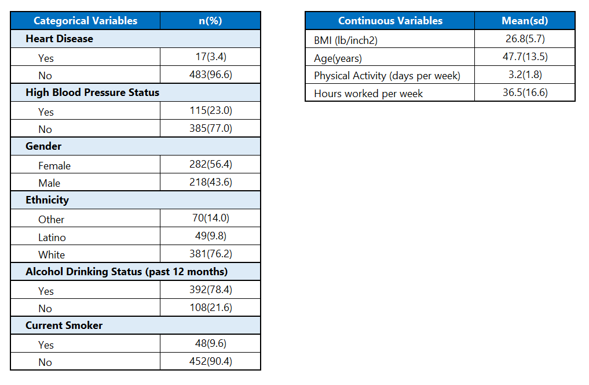
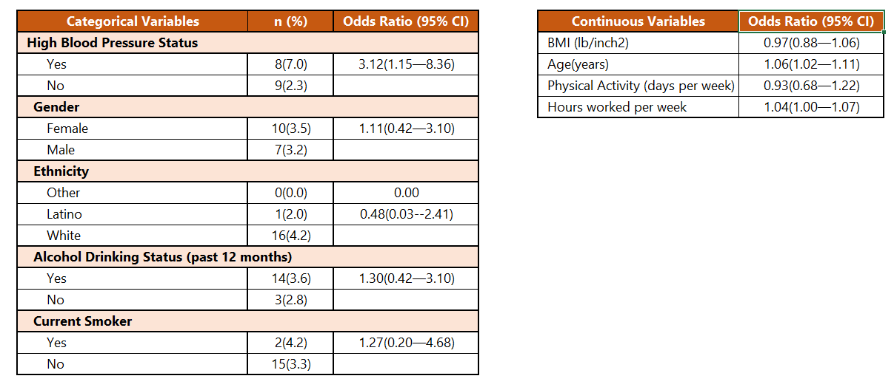
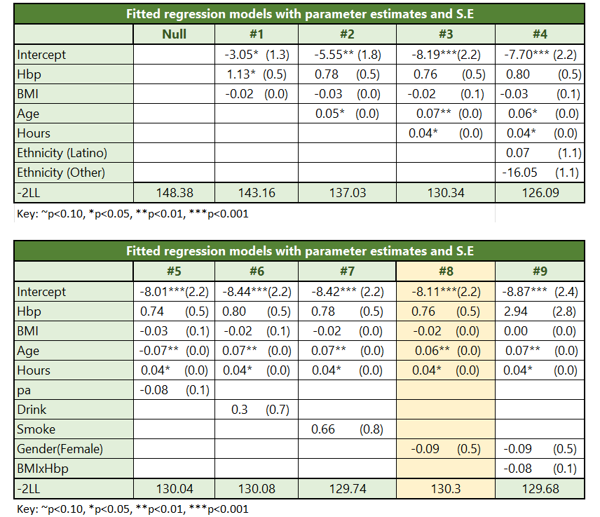
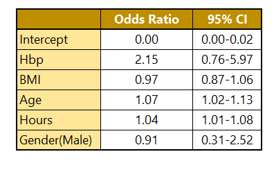

# Analyzing the Relationship between Obesity, Hypertension, and Heart Disease through Logistic Regression

This data analysis explores the association between obesity, hypertension, and heart disease within a specified population. The study utilizes data named "SURVEY," extracted from a random sample of 500 individuals participating in the California Health Interview Survey (CHIS) 2009. The primary focus is on using Heart Disease (hd) status as a dichotomous outcome variable, and various predictor variables including blood pressure (hbp), height, weight, age, gender, smoking habits (smoke), alcohol consumption (drink), physical activity (pa), and ethnicity. The central question addressed by this analysis is: Do individuals who are both obese and hypertensive exhibit a higher likelihood of having heart disease? The aim is to explore the relationship between these factors and provide insights into the potential association between obesity, hypertension, and the occurrence of heart disease in the sampled population.

#### **Data Management**
The initial phase of the analysis involves data management tasks, such as data reading, conversion of hbp, gender, drink, smoke, ethnicity, into factors with assigned labels, and computation of BMI using weight and height. Subsequently descriptive statistical analyses are carried to understand the distribution of key variables.

#### **Bivariate Analysis**
Bivariate analyses are performed to examine the unadjusted associations between heart disease and individual factors such as high blood pressure, smoking, gender, alcohol consumption, ethnicity, age, physical activity, hours worked per week, and BMI. The analysis involves calculating the proportion of heart disease within each level of categorical variables. Logistic regression models are then employed to quantify the associations, providing odds ratios and their corresponding 95% confidence intervals for each factor. This approach aims to comprehensively assess the relationships between individual variables and the occurrence of heart disease.

#### **Model Building**
The subsequent stage involves model building, where logistic regression models are constructed with different combinations of variables based on predictors significantly related to heart disease. Employing a forward stepwise regression procedure, the final parsimonious model is developed to optimally predict the likelihood of heart disease, taking into account factors such as obesity, hypertension, and other relevant variables. To assess possible confounding, the change-in-estimate criterion is applied, with a cutoff of 10%. This involves examining alterations in the adjusted parameter estimates of the primary effect in the presence of potential covariates.

#### **Goodness-of-Fit Test**
The likelihood ratio test is employed to assess the goodness-of-fit for the final logistic regression model.

#### **Post-Hoc General Linear Hypothesis Tests**
The final part of the code conducts hypothesis tests to compare specific groups, such as obese hypertensive subjects vs. normal-weight hypertensive subjects, and other relevant comparisons. 

## Tables and Findings

#### Univariate Descriptive Analysis of the Survey Population (n=500)

#### Bivariate Analysis of Associations between High Blood Pressure Status, BMI, and Other Predictor Variables with Heart Disease Status in the Survey Population (n=500)

#### Bivariate Analysis
In the above table it is observed that hypertensive individuals exhibit a higher proportion of heart disease compared to non-hypertensive individuals. The unadjusted odds of heart disease are 3.12 times higher in hypertensive individuals than in non-hypertensive individuals, with a significant odds ratio and a 95% confidence interval (CI) of 1.15—8.36.
In contrast, females demonstrate a similar proportion of heart disease compared to males. The unadjusted odds of heart disease among females are 1.11 times those among males, but this odds ratio is found to be statistically insignificant, as reflected by the 95% CI of 0.42—3.10.
Regarding ethnicity, white individuals exhibit the highest proportion of heart disease compared to other ethnic groups. The unadjusted odds of heart disease among Latino individuals are 0.48 times the odds among white individuals, and the confidence intervals for this odds ratio indicate insignificance.
Drinkers and current smokers show a higher proportion of heart disease compared to non-drinkers and non-smokers, respectively. However, the unadjusted odds ratios for both groups are found to be statistically insignificant, as indicated by the 95% CI. The unadjusted odds of heart disease among drinkers is 1.3 times the odds among non-drinkers. The unadjusted odds of heart disease among current smokers is 1.3 times the odds among non-smokers.
Additionally, for each 1-year increase in age, the odds of heart disease increase by 6%, and this association is found to be significant. Conversely, for each 1-day increase in physical activity, the odds of heart disease decrease by 7%, although this finding is statistically insignificant.
Furthermore, for each 1-hour increase in hours worked per week, the odds of heart disease increase by 4%, and this association is found to be significant. Lastly, for each 1-unit increase in BMI, the odds of heart disease decrease by 3%, although this relationship is statistically insignificant.

#### Modelling the relationship between Heart disease status and Predictor variables

#### Logistic Regression Model Building

In the above table Model 1, HBP and BMI are designated as high-priority variables and are consistently retained in subsequent models. Model 2 introduces the age variable, which is found to be significantly associated with heart disease and is retained in the model due to its potential as a confounding factor. Following the introduction of the age variable, there is a change of more than 10% in the estimates for BMI and HBP.
Moving to Model 3, the next significant predictor, hours worked per week, is introduced. While this variable does not produce a >10% change in the parameter estimate for HBP, it does result in a >10% change for BMI. However, hours worked per week is retained in the model as it remains significant in Model 3.
In Model 4, ethnicity is found to be non-significant and causes a >10% change in the estimate for BMI only and not for Hbp. Consequently, ethnicity is removed as we transition from Model 4 to Model 5.
From Model 5 to Model 7, variables such as physical activity, drinking, and smoking are found to be non-significant and do not produce a >10% change in parameter estimates for BMI or HBP. Therefore, these variables are removed from the models.
Model 8 introduces the gender variable, which is not found to be significant and does not produce a >10% change in parameter estimates. However, it is retained in the model as a low-priority variable, considering its role as a known confounder based on previous literature.
Lastly, Model 9 assesses the interaction between BMI and HBP, but it is found to be non-significant and is consequently removed from the model.
Additionally, when examining the fit statistic -2LL, there is a consistent reduction from the null model to Models 1 through 3, and ultimately to our final model, Model 8. This indicates an improvement in the model fit and suggests that each successive model, with the inclusion or exclusion of variables based on significance and change in estimate criteria, contributes to a better overall fit of the model to the data.

#### The Final Multivariable Model

Logit[HD=1] = β0 + β1Hbp + β2BMI + β3 Age+ β4 Hours + β5 Gender
The final multivariable model excluded physical activity, ethnicity, current smoking and alcohol drinking status, as covariates, as their inclusion did not result in a 10% or more change in the estimate for the association between exposures and outcome. However, age and hours worked per week, which did influence the estimates, were retained in the model. Additionally, considering previous literature, gender was recognized as a potential confounder and was consequently considered in the final model.

#### Odds ratios and 95% Confidence intervals for the Final Model

#### Post-Hoc GLH Test Results

##### Obese hypertensive vs normal-weight hypertensive subjects
For Obese hypertensive subjects, Hbp=1, BMI= 35.03 (mean obese BMI)
  Logit[HDA =1] = β0 + β1 x 1 + β2 x 35.03 + β3 Age+ β4 Hours + β5 Gender  

For normal weight hypertensive subjects, Hbp=1, BMI = 22.32 (mean normal BMI)
  Logit[HDB =1] = β0 + β1 x 1 + β2 x22.32 + β3 Age+ β4 Hours + β5 Gender  

OR = e -0.03  x (35.03-22.32) 
OR = 0.72   C.I = (0.21,2.52)
After controlling for age, hours worked per week, and gender the fitted odds of heart disease in an obese hypertensive subject is 0.72 times the odds in a normal-weight hypertensive subject.

##### Obese hypertensive vs overweight hypertensive subjects
For Obese hypertensive subjects, Hbp=1, BMI= 35.03 (mean obese BMI)
Logit[HDA =1] = β0 + β1 x 1 + β2 x 35.03 + β3 Age+ β4 Hours + β5 Gender 

For overweight hypertensive subjects, Hbp=1, BMI = 27.13 (mean overweight BMI)
Logit[HDB =1] = β0 + β1 x 1 + β2 x 27.13 + β3 Age+ β4 Hours + β5 Gender 

OR = e -0.03  x (35.03-27.13) 
OR = 0.81   C.I = (0.37,1.77)
After controlling for age, hours worked per week, and gender the fitted odds of heart disease in an obese hypertensive subject is 0.81 times the odds in an overweight hypertensive subject.

##### Obese hypertensive vs overweight non-hypertensive subjects
For Obese hypertensive subjects, Hbp=1, BMI= 35.03 (mean obese BMI)
Logit[HDA =1] = β0 + β1 x 1 + β2 x 35.03 + β3 Age+ β4 Hours + β5 Gender 

For overweight non-hypertensive subjects, Hbp=0, BMI = 27.13 (mean overweight BMI)
Logit[HDB =1] = β0 + β1 x 0 + β2 x 27.13 + β3 Age+ β4 Hours + β5 Gender 

OR = e 0.76-0.03(35.03-27.13) 
OR = 1.75   C.I = (0.49,6.29)
After controlling for age, hours worked per week, and gender the fitted odds of heart disease in an obese hypertensive subject is 1.75 times the odds in an overweight non-hypertensive subject.

##### Normal weight hypertensive vs overweight non-hypertensive subjects
For normal weight hypertensive subjects, Hbp=1, BMI = 22.32 (mean normal BMI)
Logit[HDB =1] = β0 + β1 x 1 + β2 x22.32 + β3 Age+ β4 Hours + β5 Gender  

For overweight non-hypertensive subjects, Hbp=0, BMI = 27.13 (mean overweight BMI)
$Logit[HD_B =1] = β_0 + β_1 x 0 + β_2 x 27.13 + β_3 Age+ β_4 Hours + β_5 Gender$  

OR = e 0.76-0.03(22.32-27.13) 
OR = 2.43    C.I = (0.79,7.45)
After controlling for age, hours worked per week, and gender the fitted odds of heart disease in a normal-weight hypertensive subject is 2.43 times the odds in an overweight non-hypertensive subject.

